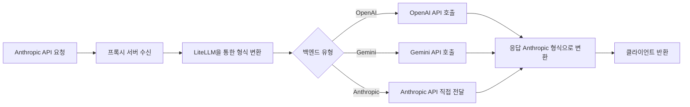

Anthropic 클라이언트(예: Claude Code)를 Gemini, OpenAI 또는 Anthropic 모델과 호환되도록 변환하는 프록시 서버입니다. LiteLLM을 기반으로 하여 Anthropic API 요청을 OpenAI 또는 Gemini 형식으로 자동 변환하며, 모델 매핑 및 스트리밍/논스트리밍 응답 호환성을 제공합니다. 사용자는 환경 변수를 통해 기본 백엔드 제공자(PREFERRED_PROVIDER)를 OpenAI, Google(Gemini), Anthropic 중 선택할 수 있으며, 로그 수집 또는 미들웨어 처리 목적으로 Anthropic 모델 직접 사용도 지원합니다.  

