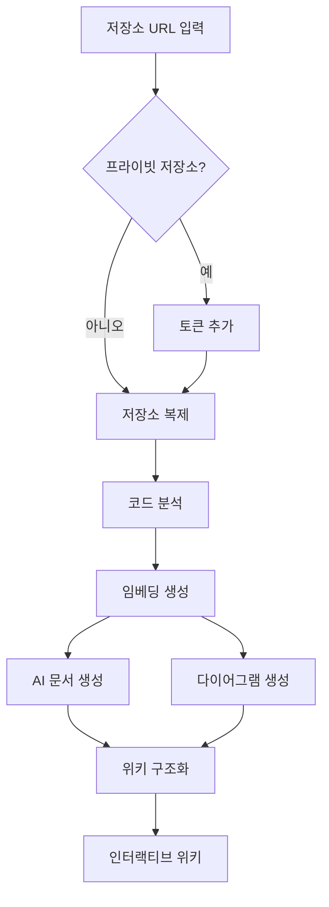

---
Language: Python  
tags:  
 - AI 문서 생성  
 - GitHub 자동화  
 - 코드 분석  
aliases:  
 - DeepWiki-Open  
 - 코드 위키 생성기  
 - DeepWiki  
url: https://github.com/AsyncFuncAI/deepwiki-open/blob/main/README.md  
---  
**DeepWiki**는 GitHub, GitLab, BitBucket 저장소를 자동으로 분석하여 문서, 다이어그램, 탐색 구조를 생성하는 AI 기반 위키 생성 도구입니다. 사용자가 저장소 URL을 입력하면 코드 구조를 분석하고, RAG 기술로 문서를 생성하며, Mermaid 다이어그램을 자동으로 생성해 사용자 친화적인 위키를 구성합니다. Google Gemini, OpenAI, OpenRouter, Azure OpenAI, Ollama 모델 등 다양한 LLM 공급자를 지원하며, 프라이빗 저장소 접근 토큰을 통해 보안이 강화된 작업을 처리할 수 있습니다. Docker 또는 수동 설치 방식으로 쉽게 배포할 수 있으며, Q&A 및 심층 연구(DeepResearch) 기능을 통해 저장소와 상호작용하는 지능형 인터페이스를 제공합니다.  

핵심 기능:  
1. **즉시 문서화**: 저장소 URL 입력만으로 문서 생성  
2. **다중 모델 지원**: Google, OpenAI, OpenRouter 등 다양한 AI 모델 선택 가능  
3. **시각적 다이어그램**: 코드 관계도 및 데이터 흐름을 Mermaid로 시각화  
4. **지능형 Q&A**: RAG 기반 저장소 채팅 기능  
5. **심층 분석**: 다단계 연구로 복잡한 주제 탐색  

````python
# 예시: 로컬 Ollama 사용 코드 조각
export DEEPWIKI_EMBEDDER_TYPE=ollama
python -m api.main
````  

> :bulb: GitHub 저장소: [https://github.com/AsyncFuncAI/deepwiki-open](https://github.com/AsyncFuncAI/deepwiki-open)  
> :closed_lock_with_key: 프라이빗 저장소 접근 시 개인 토큰 필요  
> :rocket: Docker/수동 설치 방식 지원  

---  
**기술 스택**: Python(Flask API), JavaScript(Next.js 프론트엔드), Mermaid, RAG, LLM 통합  
**사용 사례**: 오픈소스 문서화, 프라이빗 코드베이스 분석, AI 기반 코드 연구  

